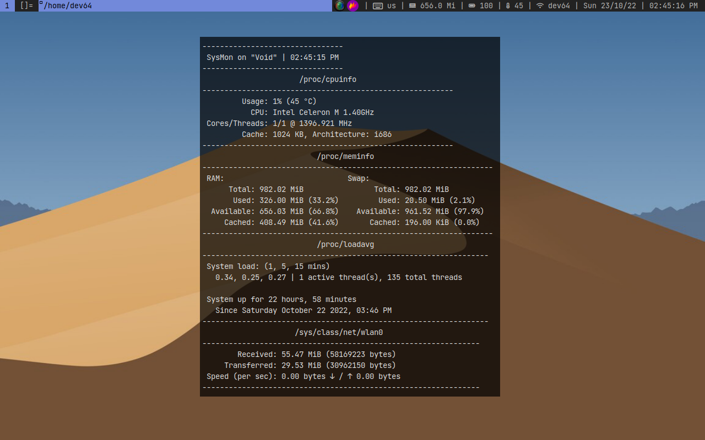

# suckless64 - my configured suckless apps

# which ones?
- dmenu
- dwm
- slstatus
- st
- surf

# patches
every (except slstatus) suckless app has patches. theyre located in APP/patches dir (note: all suckless apps are patched **ALREADY!!** no need to patch!!)

- dmenu
  - dmenu-border
  - dmenu-center
  - dmenu-highlight
  - dmenu-gruvbox is __**NOT**__ applied

- dwm
  - dwm-hide_vacant_tags
  - dwm-systray-20210418

- slstatus
  - none

- st
  - st-alpha
  - st-gruvbox-dark is __**NOT**__ applied
  - st-scrollback-mouse
  - st-anysize
  - st-scrollback

- surf
  - surf-homepage
  - surf-history

# preview

# dependecies
note: you might not need some of these. if you dont, youll need to remove them from the config files

1. flameshot (for taking screenshots)
2. simplescreenrecorder (screen recorder)
3. pactl (for controlling volume)
4. picom (transparency)
5. feh (setting wallpaper)
6. xinput (changing my mouses sensitivity, might not be needed)
7. fish shell (needed for st) (??)

# info - whats customized/included
- dmenu
  - you paste using ctrl + v, instead of shift ctrl + y
  - number of lines is 17, border_width is 4
  - SchemeSelHighlight and SchemeNormHighlight color is #7289da

- dwm
  - no xinerama support
  - you take a screenshot using the prt sc key (print screen)
  - modkey is the windows logo key
  - you kill apps using modkey + q instead of c
  - default cyan color replaced with #7289da (discords old color - blurple)
  - 5 tags instead of 9
  - font replaced with JetBrainsMono-Regular, size 10
  - terminal launches with modkey + return (enter key) instead of modkey and shift + return

- slstatus
  - nothing

- st
  - scrolling support included, change the scrolling speed of mouse wheel by editing config.def.h, line 13. you can also scroll slower holding the shift key, or scroll one page using ctrl + pg up/down keys
  - shell is set to fish (??)
  - font set to JetBrainsMono-Regular with pixelsize 14
  - tabspaces set to 4
  - alpha set to 0.7
  - cursor shape is set to bar (|)

- surf
  - homepage set to google.com

font, xinitrc and wallpaper included

# note
all suckless apps are compiled, but on a 32bit laptop! you will have to recompile if you have a 64bit computer
